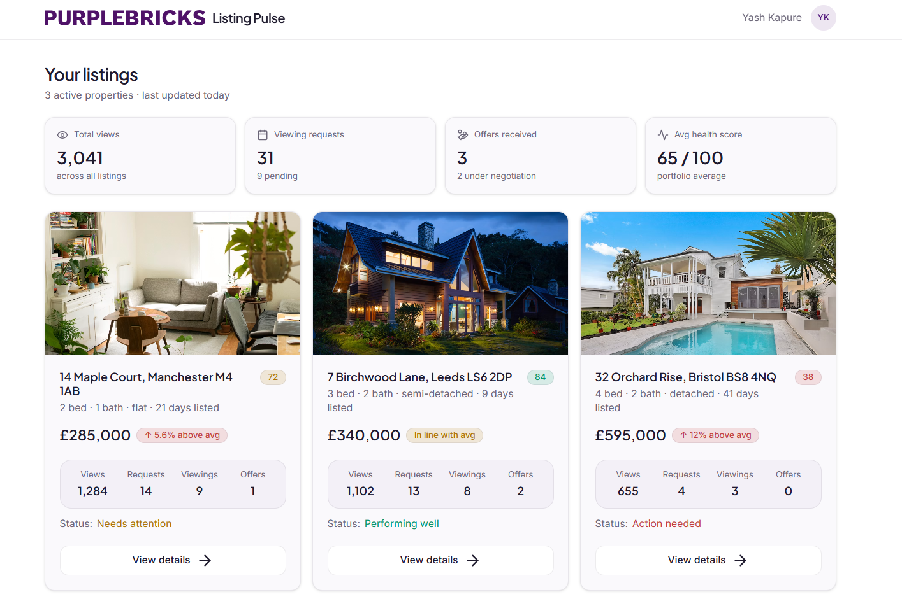
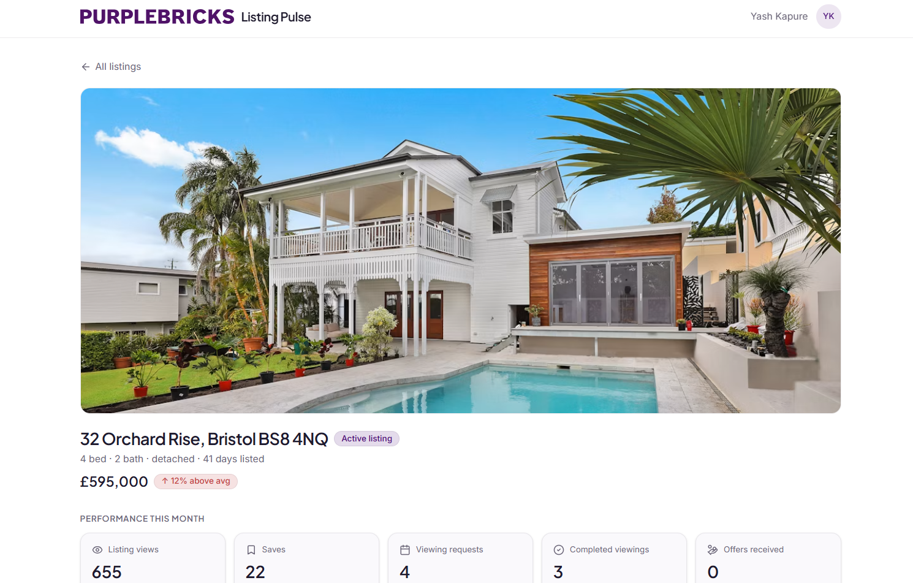
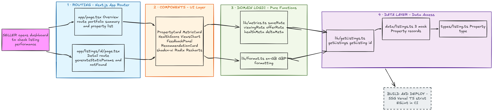

A seller-facing dashboard for Purplebricks that shows how a property listing is
performing and recommends the next actions to take.

### Why "Listing Pulse"?

**Listing Pulse** is a seller-focused dashboard that gives a quick health check of how a property listing is performing.
The name reflects the idea of tracking key signals like views, viewings, offers, feedback, and price position to help sellers decide what to do next.





## Run it

```bash
npm install
npm run dev
```

## Screens

| Route            | What it shows                                                                       |
| ---------------- | ----------------------------------------------------------------------------------- |
| `/`              | Portfolio overview - summary strip + one card per listing.                          |
| `/listings/[id]` | Single listing dashboard - metrics, health score, chart, feedback, recommendations. |

## Stack & why

- **Next.js (App Router) + TypeScript (strict, no `any`)** - Server Components render the dashboard with zero client JS except where it's actually needed.
  `generateStaticParams` pre-renders each listing at build time; this data is static, so there's no reason to pay for runtime rendering.
- **Tailwind CSS v4** - design tokens live in `@theme` in `app/globals.css`, so the palette is defined once and consumed as utilities (`bg-card`, `text-good`,
  …). The theme is **aligned to the Purplebricks brand**: light surfaces, the deep purple accent (`#4c0f78`), and Trustpilot-style green for positive signals. Centralising tokens means a rebrand (or a dark variant) is a one-file change.
- **shadcn/ui (Card, Badge, Button) over Radix primitives** - copy-in components I own and can theme, rather than a heavyweight component library. `Badge` variants map directly to the app's semantic tones, and `Button` uses Radix `Slot` (`asChild`) so it can wrap a Next `<Link>` without nesting a button in an anchor.
- **Recharts** - declarative, composable React charting. For the weekly-views trend line (axes, gridlines, gradient area, tooltip) it's more than enough and avoids hand-rolling SVG. (The health score ring, by contrast, is a few lines of hand-written SVG - not worth a dependency.)

## Architecture

```
types/listing.ts     Single source of truth - the Property model.
data/listings.ts     Mock seed data + getListing() lookup.
lib/metrics.ts       Pure, typed calculations (rates, health/delta meta, totals).
components/ui/        shadcn primitives (card, badge, button).
components/           Feature components, each single-responsibility.
app/                  Routes, layout, loading skeletons, not-found.
```

The split that matters: **all business logic is pure and lives in `lib/metrics.ts`**



## Error handling

- **Not-found is handled today** - an unknown listing id (or any unmatched route)
  calls `notFound()` and renders `app/not-found.tsx`, so a bad URL degrades to a
  clear screen, not a crash.
- **Runtime failures** would be caught with an `app/error.tsx` boundary (retry
  affordance + friendly message) and, once a real data layer exists, try/catch at
  the fetch boundary with graceful fallbacks when a metric is missing.

## Trade-offs made (deliberately, for time)

- **Mock data, no data layer** - `data/listings.ts` is imported directly. A real
  app would put a typed repository/service behind this.
- **Health-signal thresholds are heuristic** - the cutoffs in `metrics.ts` /
  `health-score.tsx` are reasonable guesses, not validated against real
  conversion data.
- **No design system beyond the three primitives** - only the components the
  brief asked for were built; no Storybook, tokens doc, or theme switch.
- **Minimal tests** - unit tests cover the calculation layer (the part most
  worth protecting); no component/e2e tests.
- **Recharts ships client JS** - the one client component on the page. Acceptable for a single chart; a fully static alternative would be server-rendered SVG.

## What I'd do with more time

- **Real API / data layer** - replace the static import with a typed fetch layer
  (server actions or a REST/GraphQL client), with proper caching/revalidation,
  plus the loading / error / empty states that mock data never forces you to handle.
- **View-requests page with filters** - a dedicated route that lists viewing
  requests, filterable by property (and date/status), so a seller can act on them
  in one place rather than per listing.
- **Image gallery** - the property detail currently shows a single image; swap it
  for a carousel/slider so a listing can present its full set of photos.
- **Richer metric cards** - the three detail cards (view requests, completed
  viewings, offers received) would expand to explain what each number means and
  how to act on it, surfacing detail on tap rather than crowding the card face.
- **Tooltips for the maths** - inline help on health score and the derived rates
  explaining _why_ and _how_ each figure is calculated. Transparency builds trust
  and helps a seller understand what's actually driving the recommendations.
- **AI-driven recommendations** - the recommendations are static today; generate
  them from real signals - including the buyer feedback comments - with the static
  set kept as a graceful fallback when the model is unavailable or low-confidence.
- **Storybook** - isolate the shared components (Card, Badge, Slider, view-request
  item) with a story per state. Enforces UI consistency, documents the component
  library for the team, and makes the loading/error/empty states reviewable
  without running the full app.
- **Security** - auth (seller can only see their own listings), authorization
  checks on the data layer, input validation, security headers/CSP.
- **Testing** - component tests (React Testing Library) for the tone/threshold
  rendering, plus a Playwright smoke test of both routes.
- **Architecture** - derive the recommendations from the metrics instead of
  hard-coding them per listing (a small rules engine), and validate the data
  model with Zod at the boundary.
- **Polish** - chart loading/animation, motion on cards, real avatars, a
  last-updated timestamp from data rather than "today".

## AI usage

I started with **ChatGPT** as a research tool - understanding how Purplebricks
works as a business and what a seller actually cares about. That research is
where the product idea came from: a seller-facing dashboard that turns listing
performance into clear next actions. The concept, the framing, and the decision
of _what to build_ are mine.

From there I used **Claude Code** as an implementation tool - to
scaffold the structure, generate the typed component/metric boilerplate, and
draft the mock seed data and this README. I directed the architecture (pure
metrics layer, shared `Property` model, Server Components by default, tone-driven
styling), specified the stack and theme.
